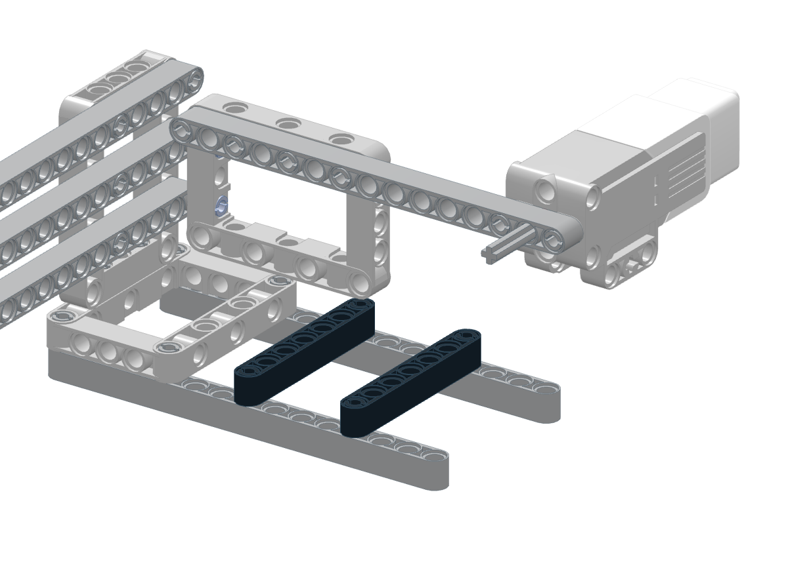
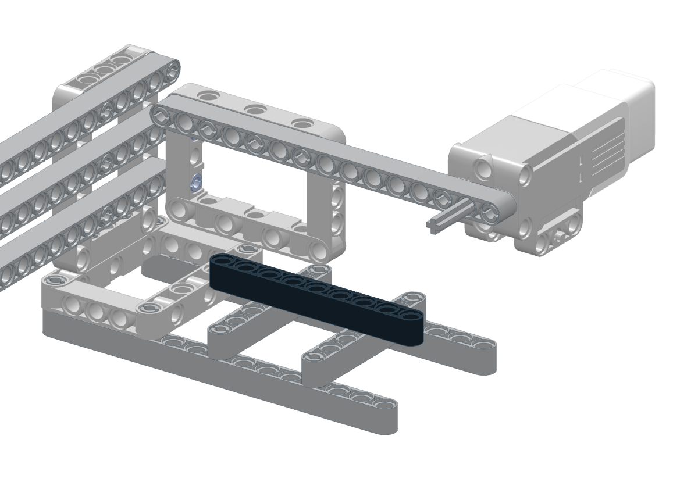
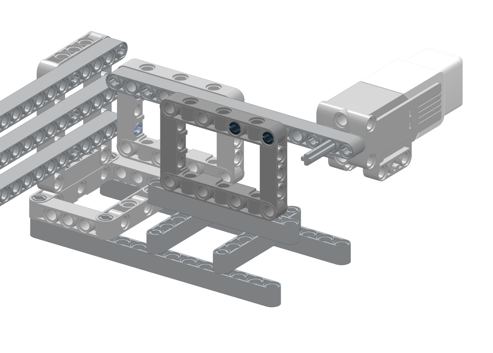
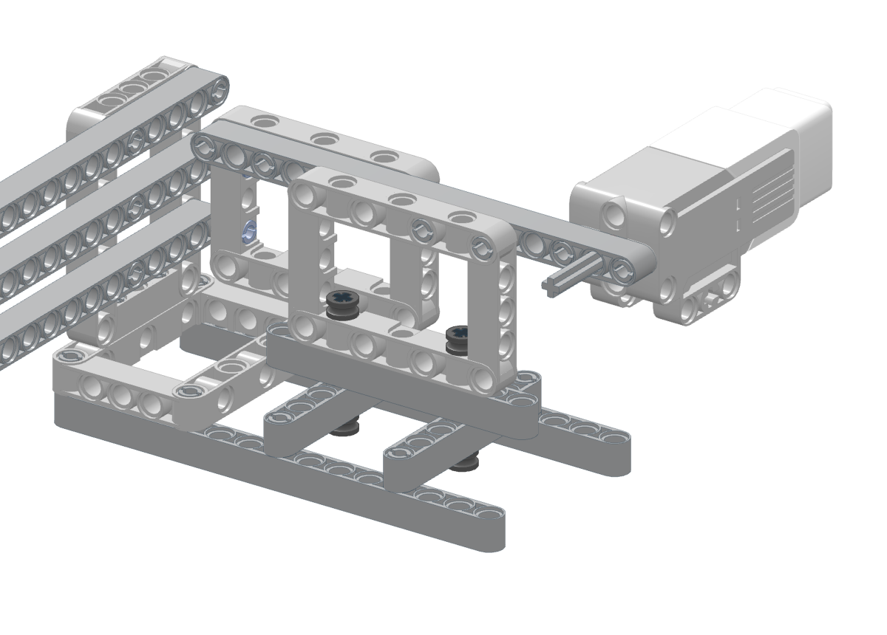

# 中马达固定支架补强：旧版补装说明

> **当前已停止优化此方案。** 用户决定后续使用[大马达结构](../index.html)继续验证。本页作为设计过程归档保留，补强效果未经过实物验收。

2026-09-28。针对实物照片 IMG_0061、IMG_0062 中马达固定端悬伸、用户观察到整体下垂的问题。补强后的承重效果尚待实物验收；当前不继续动力调参。

[打开新版搭建图，第9步开始](index.html#s9) · [下载更新后的LDraw模型](model.ldr)

## 已保存的修复前状态

- [完整参数](../../measurements/2026-09-28-ev3-medium-installed/pre-support-fix-settings.json)：9V，`umax=0.90`、`kfs=0.46`、`vmax=60`、`amax=200`。保留全部原始日志与轨迹，未覆盖大马达归档，也未改写Pico配置。
- [实物后侧照片](../../measurements/2026-09-28-ev3-medium-installed/photos/IMG_0061.JPG)、[实物前侧照片](../../measurements/2026-09-28-ev3-medium-installed/photos/IMG_0062.JPG)。
- 编码器角度成功不能证明叉子空间位置准确，也不能替代承重检查。照片有透视，不据此宣称下垂的精确角度或位移。

## 改哪里

原15孔马达固定梁从后方框架伸出，在马达附近缺少通到底脚的支撑。新版在这根固定梁另一侧增加一块竖框，用两根底部横梁和一根垫梁接到现有两根底脚。重量经固定梁、竖框、垫梁、横梁传到底脚；原后支架仍保留。

支撑向马达方向的边缘保留在模型规定位置，不能再向前移一个孔距：更靠前会与旋转的联轴梁相撞。新支撑不接触旋转轴、转动座和滑块。

## 新增零件（颜色不限）

| 零件 | 编号 | 数量 |
|---|---|---:|
| 7×5框架 | 64179 | 1 |
| 7孔粗梁 | 32524 | 2 |
| 9孔粗梁 | 40490 | 1 |
| 2孔长摩擦销 | 2780 | 6 |
| 4号轴（无挡肩） | 3705 | 2 |
| 半轴套 | 32123a | 4 |
| **合计** | | **16** |

## 补装顺序

先关闭9V并拔下USB，取走魔方，用手托住马达固定端，避免装销时压歪联轴处。此次不改接线，不需要拆下前方机械手。

### 第9步：两根承重横梁

在马达侧原有两根底脚之间横放两根7孔梁。每根梁两端各用一根2孔长摩擦销接到底脚。两根横梁相距4个孔距（32mm）；靠马达的一根位于底脚前端向内第4孔，另一根在第8孔，端头的孔计为第1孔。

### 第10步：一根垫梁

将9孔梁纵放在两根新横梁正中间。它的第3孔、第7孔分别对准两根横梁的中间孔，先对齐放好，暂不插销或轴。

### 第11步：先连接上方横销，底部不锁定

1. 先将两根2孔长摩擦销各插半截到原15孔马达固定梁的对应孔，另一半朝新竖框方向伸出。
2. 托住马达固定端，把7×5框架上边两孔对准横销，横向推入到位。框架7孔长边水平、5孔短边竖直。
3. 框架底边对准垫梁即可，**本步不插底部贯穿轴**。

### 第12步：从底部穿入4号轴，再装半轴套

**撤回上一版“从框架内侧向下插蓝色长销”的步骤。** 6558长销有挡肩，两侧分别为一孔长和两孔长；挡肩不能穿过孔。即使调整顺序，也不能把它当成无挡肩直杆贯穿三层。

1. 上方横销连接完成后，托住机械手，将整套底座侧放，露出横梁底面。不要只扳动马达支架或旋转机械手来翻底座。
2. 每处用一根无挡肩的4号轴，从底下向上穿过横梁、9孔垫梁和竖框底边。这三层共3个孔距，4号轴穿好后两端各露出约半个孔距（4mm）。
3. 上端从竖框中央开口套入一个半轴套；下端从底座下面套入另一个半轴套。两根轴共用4个半轴套。轴套贴住零件表面即可，不要夹到框架变形。
4. 把整套底座放回桌面。下端半轴套留在两根底脚之间，模型中不会顶到桌面。

仍须先连接上方横销，再安装底部贯穿轴；不能先锁底部再横推框架。当前共26步，新增16件，其余机构保留。图显示装好后的位置；穿轴时应按上文将底座侧放，而不是在桌面上强塞。

## 装好后如何判断是否解决

保持断电、不放魔方：

1. 放开托住马达的手，观察马达固定端是否仍明显下垂；轻托后松开，比较固定梁与后支架的相对位置。
2. 检查输出轴、联轴件和转动座是否对正。正确标准是轴线与叉子中心对齐，不要求不同形状零件的外沿都齐平。
3. 在此前确认的中位至±90°范围内轻缓转动，不能出现新增碰撞、卡点或拉线。不要为检查几何而强转整圈。
4. 若固定部分稳定，但前方转动座仍下垂，需继续处理旋转轴/联轴件/导轨的支撑；本次没有增加独立旋转轴承。

满足以上条件后，重新上电，以已保存参数从小角度往返开始复核。不要把补强前的参数当作补强后已验证的参数。

## 已执行的模型检查

`tools/lego/run_check.py` 对大、中两种版本运行：夹紧/松开实体干涉、销轴连接、每15°整圈旋转扫描、魔方0–90°翻转间隙。结果为0个问题。检查采用2 LDU体素，未模拟材料弹性、销孔间隙、承载变形或线缆；只能说明名义几何通过，不能证明实物刚度已经解决。
