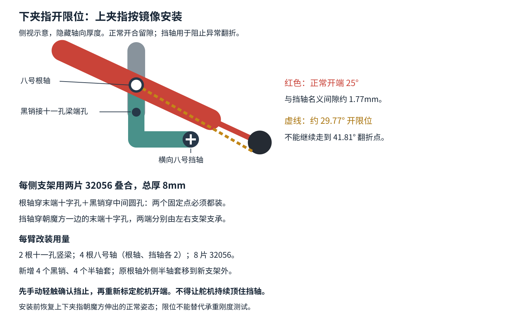

# 推杆后拉翻折：原因、修正与试装

## 已确认的失效与检查遗漏

用户提供的 IMG_0067、IMG_0068 显示下夹指可翻到近乎竖直的位置，并确认触发过程是“继续向后拉推杆时，突然跳过去”。这属于大角度姿态翻折，不能用小变形刚度计算解释。

当前杆长在相同推杆位置存在两组装配解：

| 推杆自夹紧端后退 | 正常主臂角 | 另一组解 |
|---|---:|---:|
| 0mm | 3.84° | 102.01° |
| 10.00mm | 25.00° | 61.24° |

约后退 **11.600mm** 时，两组解在 **41.810°** 汇合，距正常开端仅 **1.603mm**。照片和触发过程与接近该位置后受间隙／变形影响而翻折相符。两张静态照片不能测定实际跳变位置、杆件弹性或各连接的游隙。

此前 `jaw_beta()` 直接选择正常解，模型又令上下主臂对称，所以碰撞检查没有验证实物能否保持这组装配姿态。**这是原设计缺少防翻折约束及验证覆盖不足，不是无摩擦销不能承重。**

## 当前修正

每个夹指增加一根独立横向开限位挡轴，挡轴随机械头整体回转，但不随主臂开合转动。正常开角仍为25°。

- 两侧竖梁由9孔改成 **32525 十一孔梁**，根轴仍在原位置，对应从上数第2、10孔。
- 每根根轴改用 **3707 八号轴**，贯穿主臂、两侧竖梁及外侧限位支架。
- 每个夹指两侧各叠两片 **32056 三乘三 L 形薄梁**，一侧总厚8mm；每臂共8片。根轴穿竖边末端十字孔，黑销把竖边中间圆孔接到十一孔梁端孔，形成两个固定点。
- L形薄梁另一边朝魔方，其末端十字孔贯穿另一根八号轴作为挡轴，两端半轴套定位。上下各一根。
- 原根轴外半轴套移到新支架外面；挡轴另加半轴套。轴两端均有支承，不让单根悬臂销独自挡住夹指。

不能用3×5 L形粗梁直接替代：前伸的多余部分已经在四臂检查中发现会碰到邻臂回转中的轮胎。最终采用短的3×3薄梁双片叠合。

### 每臂相对上一版的零件变化

| 零件 | 变化 |
|---|---|
| 40490 九孔粗梁 | 拆下机械头上的2根；平台上的九孔梁不改 |
| 32525 十一孔粗梁 | 增加2根 |
| 3706 六号根轴 | 拆下2根 |
| 3707 八号轴 | 增加4根：2根根轴＋2根挡轴 |
| 32056 三乘三 L形薄梁 | 增加8片 |
| 2780 黑色摩擦销 | 增加4个 |
| 32123a 半轴套 | 增加4个用于挡轴；原根轴外侧4个重新定位 |

四臂用量将以上乘4。32056库存未确认，不能把现有直薄梁按相同孔位代用。完整用量见 [BOM](bom.csv)，装配见[第13、15步](index.html#s15)。

## 验证范围

专项结果见 [open_stop_checks.json](open_stop_checks.json)。检查直接旋转每个主臂的真实三角网格，不调用“只选正常解”的运动函数来掩盖异常姿态。

- 名义25°开角，主臂与挡轴间隙约 **1.770mm**。
- 名义首次实体接触约 **29.775°**，对应推杆后退 **10.814mm**，早于11.600mm汇合位置。
- 另以挡轴截面方向每5°变化作敏感性检查：接触角约29.62°～30.27°，正常开端最小间隙约1.739mm，距汇合位置的推杆行程裕量至少约0.719mm。实际挡轴由支架十字孔约束，此检查不表示装好后应让轴自由旋转。
- 每个截面方向下，从首次接触到汇合角再取50点，主臂均无法在刚性几何中穿过挡轴。
- 模型 `module()` 拒绝超出0～10.00mm正常开合区间的指令。**这只约束模型入口，不会自动限制实物手拉或固件原始 `servo` 命令。**

已重新检查新增件连接、插深、孔型、全正常开合行程，以及四臂回转空间。刚性网格能证明挡止位置，不能证明乐高轴的抗弯强度或实物大力拉动时不会越过限位。

## 按这个顺序改装与试验

1. 脱开舵机连杆，托住夹指，将上下主臂都恢复到朝魔方伸出的正常姿态。错误分支不能作为装配起点。
2. 按第13、15步更换竖梁及根轴，装两侧双片支架、黑销、挡轴和半轴套。确认每侧都有“根轴＋黑销”两点固定；确认两片薄梁叠齐、主臂仍能自由转动。
3. **先手动缓慢开合**：正常开端约25°，不碰挡轴；再轻推确认每只夹指独立在约30°被挡住。接触即停，不用力压弯挡轴，也不靠拉过挡轴来检验强度。
4. 分别轻扶住上夹指、下夹指验证另一只，确认某只受到扰动时不会独自翻到竖直。转动机械头后重复，特别检查倒置姿态。
5. 重新标定舵机开端，使正常工作到25°附近就停止，并保留实体间隙。不要把挡轴当作舵机寻零点或持续保持的终点。旧开端脉宽不能直接使用。
6. 防翻折手动检查通过后，再进行 [100g承重测试](gravity_test.md)，区分正常范围内的下垂与翻折。限位不消除根轴、转盘、输入铰链或轮胎的柔度。

**实物防翻折尚未验收。** 新结构已落实到模型和装配图；需要以上轻载手动确认及重新标定，不能据名义接触角直接宣称实物失控已排除。
